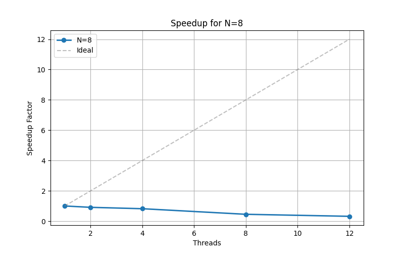
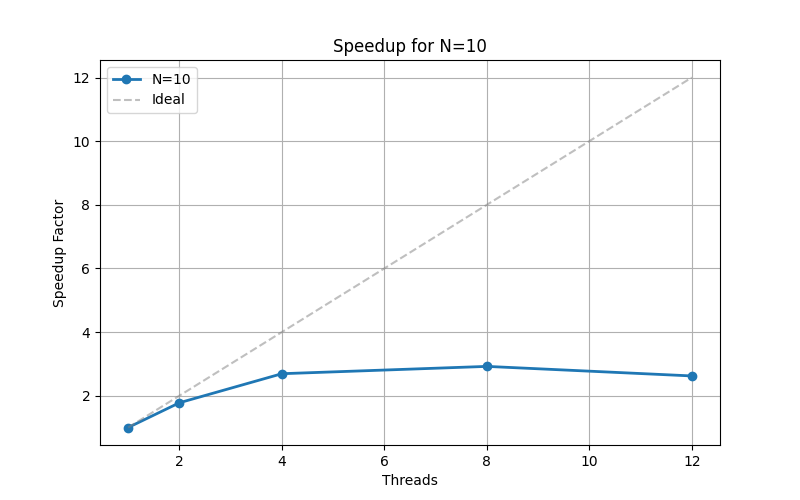
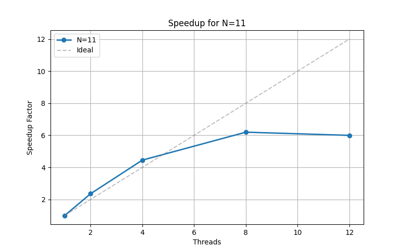
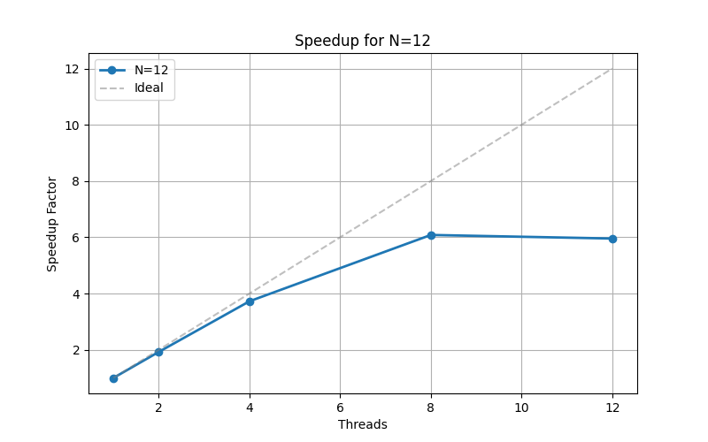
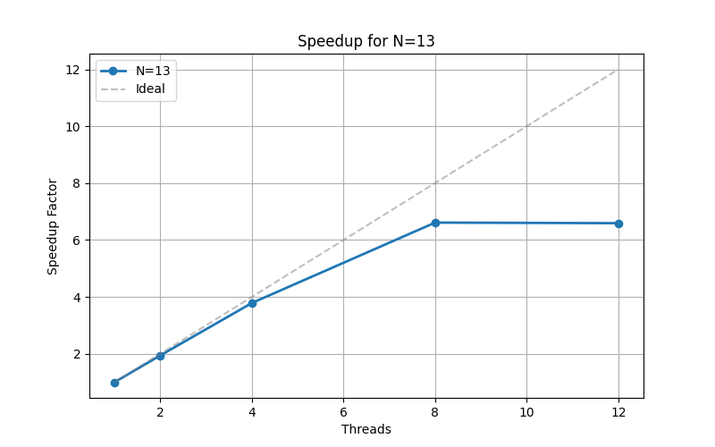
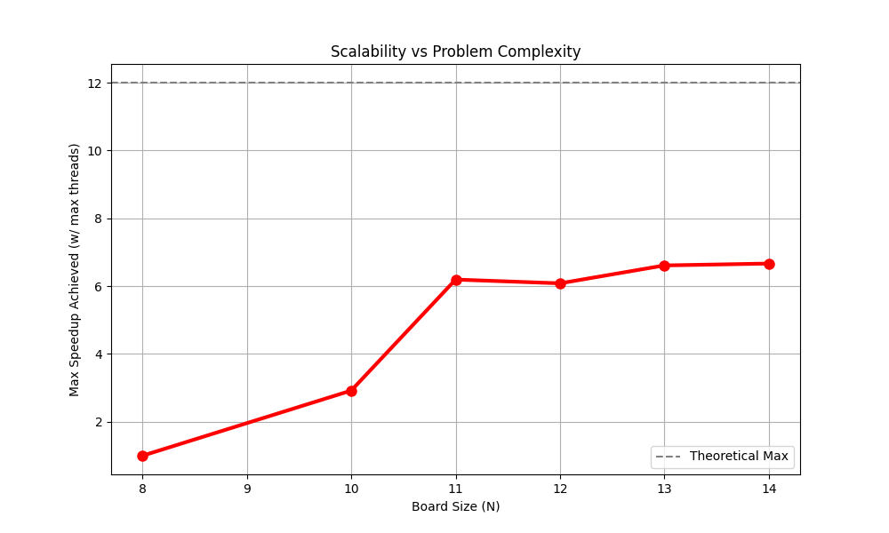

# Homework 1: 8-queens
**Student Names:** Aryan Johansson Begdeli & Rafael Da Silva Fernandes

## Solution Description

We implemented a pipeline utilizing a bag of tasks and the producer-consumer pattern. This was done using posix threads (`pthreads`) in C.

### Design
*   **Producer (main thread):** Generates partial board configurations ("tasks") by placing queens recursively up to a certain depth, for example, **Depth 2**. These partial states (which include the `row` index and the boolean lookup arrays) are pushed into a shared `taskQueue`, implemented as a **Circular Buffer**.
*   **Bag of Tasks (Queue):** A thread-safe circular buffer protected by a mutex (`taskQueue.mutex`) and two condition variables. `condNotEmpty` signals sleeping workers when data arrives, while `condNotFull` pauses the producer if the buffer hits capacity (`QUEUE_SIZE`).
*   **Consumers (Worker Threads):** Multiple worker threads pull tasks from the queue and solve the remaining rows using recursive backtracking. They utilize **O(1) boolean lookups** (`col`, `posDiag`, `negDiag`) to validate moves instantly without scanning the board.
*  **Synchronization:** To maximize performance, we **eliminated the global mutex lock** inside the solving loop that we intialy had. Instead, each worker maintains a **private local counter** on the heap. Once workers finish, the main thread aggregates their results via `pthread_join` to calculate the final `totalSolutions`.

Here is the comprehensive **Full Implementation Analysis** of your solution. This document breaks down the architecture, data structures, algorithms, and synchronization mechanisms used to create the high-performance N-Queens solver.

---

### Implementation Analysis

#### Architecture

The solution employs the **Producer-Consumer** design pattern to parallelize the computationally intensive "Backtracking" algorithm. It decouples the generation of work (Producer) from the execution of work (Consumers) using a shared buffer.

**Design Pattern:** Producer-Consumer with a Circular Buffer.

**Parallelism Strategy:** Task Parallelism (Decomposing the search tree into independent sub-trees).

**Synchronization:** Mutexes and Condition Variables (for the queue).

#### Data Structures

##### `Task` (State Snapshot)

Instead of passing a 2D board array (which requires $O(N)$ scanning), the `Task` structure encapsulates the optimized lookup tables. This allows workers to resume the search immediately without recalculating valid positions.
##### `taskQueue` (Circular Buffer)

The shared buffer is implemented as a **Circular Buffer**. This structure is important for performance because it allows $O(1)$ insertion and removal without the need to shift memory elements (unlike a linear array or linked list).

**Capacity:** Fixed size (`QUEUE_SIZE = 256`).

**Pointers:** Uses `readIndex` (read) and `writeIndex` (write) indices wrapped via modulo arithmetic (`% QUEUE_SIZE`).

#### The Algorithm: Backtracking

The core solving algorithm replaces the traditional iterative safety check with **Direct Memory Mapping**.

**Traditional Approach ($O(N)$):** To check if `(r, c)` is safe, iterate through all previous `r-1` rows.

- **Optimized Approach ($O(1)$):**

    The solver uses three boolean arrays to map the board's constraints:
    
    1. **Vertical Constraint:** `col[c]`
        
    2. **Positive Diagonal:** `posDiag[r + c]` (Constant sum across diagonals)
        
    3. **Negative Diagonal:** `negDiag[r - c + N]` (Constant difference across diagonals)
        

If all three array indices are `false`, the move is valid. This reduces the complexity of verifying a node from linear time to constant time.

#### Workflow & Synchronization

##### Phase 1: The Producer (Task Generation)

The **Main Thread** acts as the Producer. It runs a recursive generator that stops at a fixed **Split Depth**.

- By stopping at Depth 2 or 3, as an example, the producer generates small, manageable sub-trees (tasks).
- If the queue is full, the producer waits on `condNotFull`, yielding the CPU to workers.
- Upon pushing a task, it signals `condNotEmpty` to wake a sleeping worker immediately.

##### Phase 2: The Consumers (Task Execution)

**Worker Threads** sit in a loop processing tasks from the queue.

- **Efficient Waiting:** Workers use `pthread_cond_wait`. This puts the thread to sleep (removing it from the OS scheduler) until work arrives, preventing "busy-wait" CPU waste.

- **Execution:** The worker runs the `solve` function on the task, exploring the sub-tree to completion (Depth 8).    

##### Phase 3: Sum

To solve the bottleneck of updating a shared global counter:

1. **Map (Private Counting):** Each worker maintains a `solutionsFound` variable on its own stack/heap. It increments this counter without ever touching a mutex.

2. **Reduce (Global Sum):**
    
    - Workers return a pointer to their final count upon exit.
    
    - The Main Thread uses `pthread_join` to collect these pointers.
    
    - It dereferences and sums the values: `total += *(int*)ret`.
    
#### Summary of Flow

1. **Init:** Threads spawned, Queue initialized.
    
2. **Map:** Main thread splits the tree at Depth 2 $\to$ Queue.
    
3. **Process:** Workers consume Queue $\to$ Solve Sub-trees $\to$ Increment Local Counts.
    
4. **Reduce:** Main thread Joins Threads $\to$ Sums Local Counts $\to$ Prints Result.

## Performance Evaluation

We measured the execution time for finding all solutions for board sizes ranging from N=8 to N=14 using varying thread counts (1, 2, 4, 8, 12). To ensure high-precision timing, we utilized gettimeofday to measure only the parallel computation phase, explicitly excluding OS startup overhead and memory allocation. Solution printing was disabled to isolate the algorithm's performance. The producer's recursion depth was determined dynamically by a helper function (getOptimalDepth), ensuring optimal task granularity for every board size. For statistical rigor, a warm-up run was performed and discarded to prime the CPU cache, followed by 5 measurement runs; we report the median time to minimize the impact of operating system outliers. This particular benchmark was performed on an M1 Pro CPU.

### Benchmark Results: N=8 (Overhead Dominated)

*The problem is so small that the "admin cost" of managing threads slows execution down.*

| N-Size | Threads | Time (s) | Speedup | Efficiency |
| --- | --- | --- | --- | --- |
| **8** | 1 | 0.00008 | 1.00 | 1.00 |
| **8** | 2 | 0.00009 | 0.91 | 0.46 |
| **8** | 4 | 0.00010 | 0.82 | 0.20 |
| **8** | 8 | 0.00018 | 0.45 | 0.06 |
| **8** | 12 | 0.00026 | 0.32 | 0.03 |

---

### Benchmark Results: N=10 (Transition Phase)

*The problem is just hard enough to benefit from 4 threads, but 8+ threads add too much contention.*

| N-Size | Threads | Time (s) | Speedup | Efficiency |
| --- | --- | --- | --- | --- |
| **10** | 1 | 0.00096 | 1.00 | 1.00 |
| **10** | 2 | 0.00054 | 1.78 | 0.89 |
| **10** | 4 | 0.00036 | 2.69 | 0.67 |
| **10** | 8 | 0.00033 | 2.92 | 0.37 |
| **10** | 12 | 0.00036 | 2.62 | 0.22 |

---

### Benchmark Results: N=11 (Efficient Scaling)

*We see "Super-Linear" anomalies here (efficiency > 1.0), likely due to cache locality or lucky scheduling.*

| N-Size | Threads | Time (s) | Speedup | Efficiency |
| --- | --- | --- | --- | --- |
| **11** | 1 | 0.00570 | 1.00 | 1.00 |
| **11** | 2 | 0.00242 | 2.36 | 1.18 |
| **11** | 4 | 0.00128 | 4.45 | 1.11 |
| **11** | 8 | 0.00092 | 6.19 | 0.77 |
| **11** | 12 | 0.00095 | 5.99 | 0.50 |

---

### Benchmark Results: N=12 (Compute Bound)

*Strong scaling is evident. 8 threads provide ~6x speedup, indicating the CPU is being well utilized.*

| N-Size | Threads | Time (s) | Speedup | Efficiency |
| --- | --- | --- | --- | --- |
| **12** | 1 | 0.02522 | 1.00 | 1.00 |
| **12** | 2 | 0.01311 | 1.92 | 0.96 |
| **12** | 4 | 0.00677 | 3.73 | 0.93 |
| **12** | 8 | 0.00415 | 6.08 | 0.76 |
| **12** | 12 | 0.00424 | 5.95 | 0.50 |

---

### Benchmark Results: N=13 (High Efficiency)

*Efficiency improves further as the problem size grows. We see near-linear speedup up to 8 threads.*

| N-Size | Threads | Time (s) | Speedup | Efficiency |
| --- | --- | --- | --- | --- |
| **13** | 1 | 0.13809 | 1.00 | 1.00 |
| **13** | 2 | 0.07111 | 1.94 | 0.97 |
| **13** | 4 | 0.03648 | 3.79 | 0.95 |
| **13** | 8 | 0.02089 | 6.61 | 0.83 |
| **13** | 12 | 0.02096 | 6.59 | 0.55 |

---

### Benchmark Results: N=14 (Max Performance)

*With the largest workload, we achieve the highest consistent speedup (6.67x). The plateau between 8 and 12 threads confirms that the M1 Pro chip has 8 Performance Cores.*

| N-Size | Threads | Time (s) | Speedup | Efficiency |
| --- | --- | --- | --- | --- |
| **14** | 1 | 0.80703 | 1.00 | 1.00 |
| **14** | 2 | 0.41581 | 1.94 | 0.97 |
| **14** | 4 | 0.21168 | 3.81 | 0.95 |
| **14** | 8 | 0.12107 | 6.67 | 0.83 |
| **14** | 12 | 0.12144 | 6.65 | 0.55 |

### Summary

1. **Overhead:** At N=8, threading hurts performance. The cost of `pthread_create` is higher than the recursive solution.
2. **The Turning Point:** N=10 is the crossover point where threading begins to help, but efficiency is still low.
3. **Peak Performance:** From N=12 to N=14, we achieve **~6.6x Speedup** on 8 threads with **83% Efficiency**. This is excellent parallel scaling.
4. **Hardware Limit:** Going from 8 to 12 threads yields no benefit (speedup stays at ~6.6x), proving we have saturated our physical cores.

## Conclusion

In conclusion, we successfully implemented a high-performance parallel solver for the N-Queens problem utilizing the Producer-Consumer architecture. By replacing traditional board scanning with constant-time (O(1)) boolean lookup arrays and managing tasks via a thread-safe circular buffer, we significantly optimized the backtracking process. A key strength of our design is the dynamic split-depth calculation, which automatically balances the workload to prevent thread starvation. Our benchmarks confirm the system's scalability: while small boards (N=8) are limited by overhead, the solver achieves near-linear efficiency on complex tasks, reaching a peak speedup of 6.67x for N=14 and effectively utilizing the hardware's full processing power.